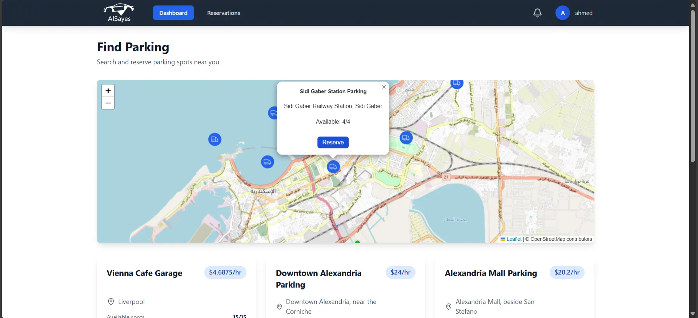
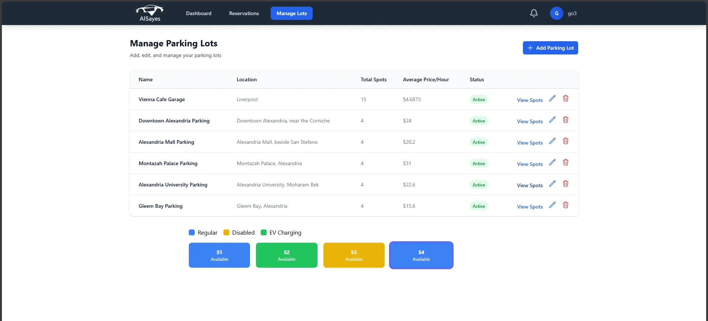
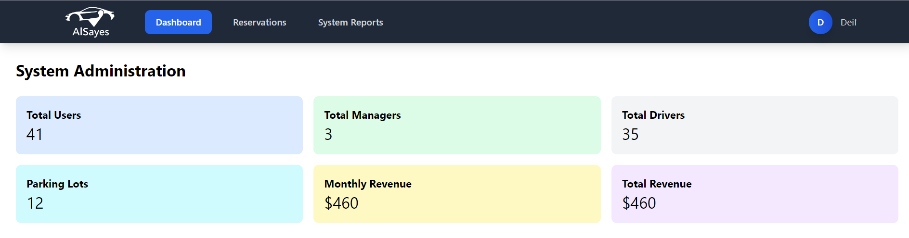

# Al-Sayes - Smart City Parking Management System

An innovative solution for managing urban parking challenges, designed to streamline parking operations and improve user convenience.

## Features

- **Real-Time Monitoring**: Dynamic updates on parking spot availability via WebSocket and simulated IoT sensors.
- **Reservation System**: Easy parking spot reservations with automated penalty management for no-shows or overtime violations.
- **Comprehensive Dashboards**: Tailored dashboards for drivers, managers, and admins to manage parking operations effectively.
- **Geolocation Integration**: GPS-enabled navigation to guide users to their reserved parking spots.
- **Scalable & Modular**: Flexible architecture supports multiple parking lots and is ready for future feature additions.
- **Advanced Reporting**: Jasper Reports integration provides detailed insights, occupancy rates, top users, and revenue trends.

## Technology Stack

- **Backend**: Java Spring Boot for scalable server-side operations.
- **Frontend**: React.js for a responsive user interface.
- **Database**: MySQL with efficient indexing and triggers for performance optimization.
- **IoT Simulation**: Python script mimicking sensor behavior for real-time testing.

## Key Functionalities

1. **Driver**:
    - View nearby parking spots and availability.
    - Get real-time navigations to the desired lot.
    - Reserve parking spots with real-time status updates.
2. **Manager**:
    - Manage parking lots and monitor spot statuses.
    - Access statistics, generate reports, and optimize lot performance.
3. **Admin**:
    - Oversee the system with powerful dashboards.
    - Generate and download detailed performance reports.

## Screenshots

- **Driver Dashboard**: Check nearby parking spots in real-time.

- **Manager Interface**: Manage parking lots and view analytics.

- **Admin Reports**: Generate detailed reports on system performance.

## Contributors

- AbdElRahman Osama
- AbdElRahman Deif
- Ahmed Youssef
- Mohamed Mahfouz